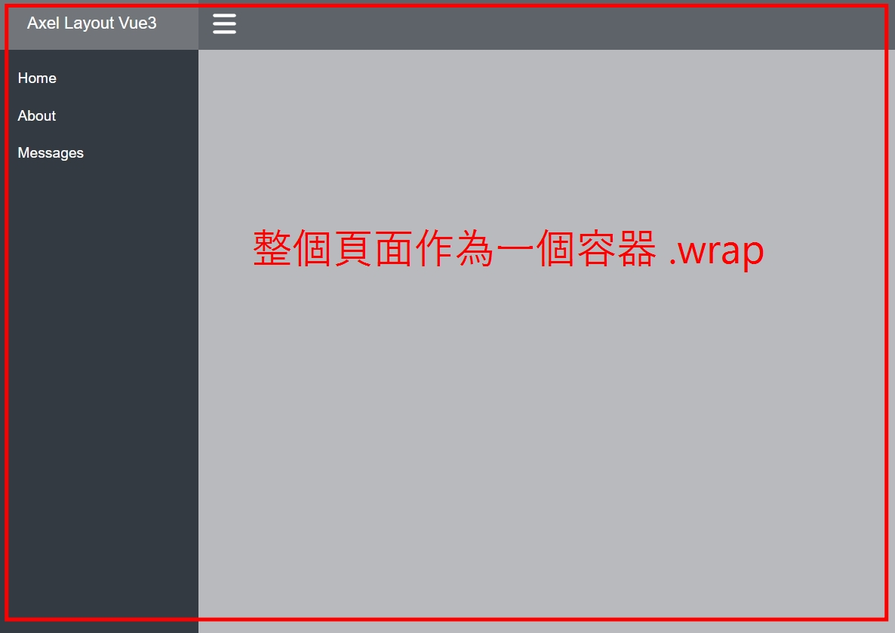
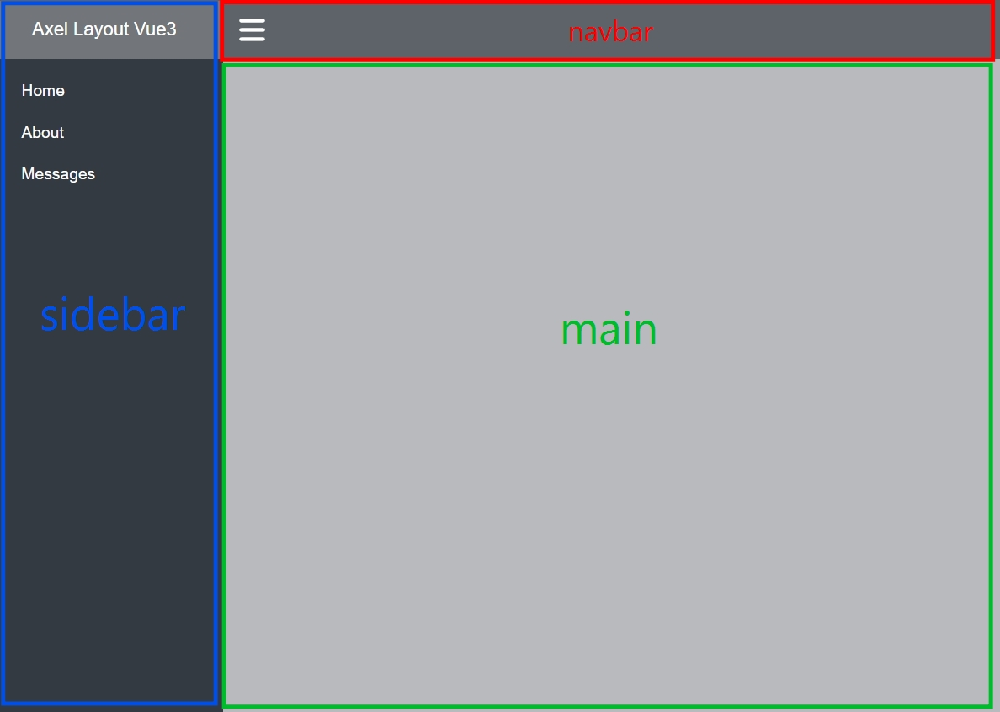
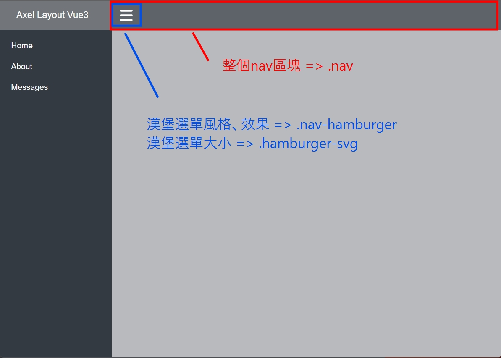
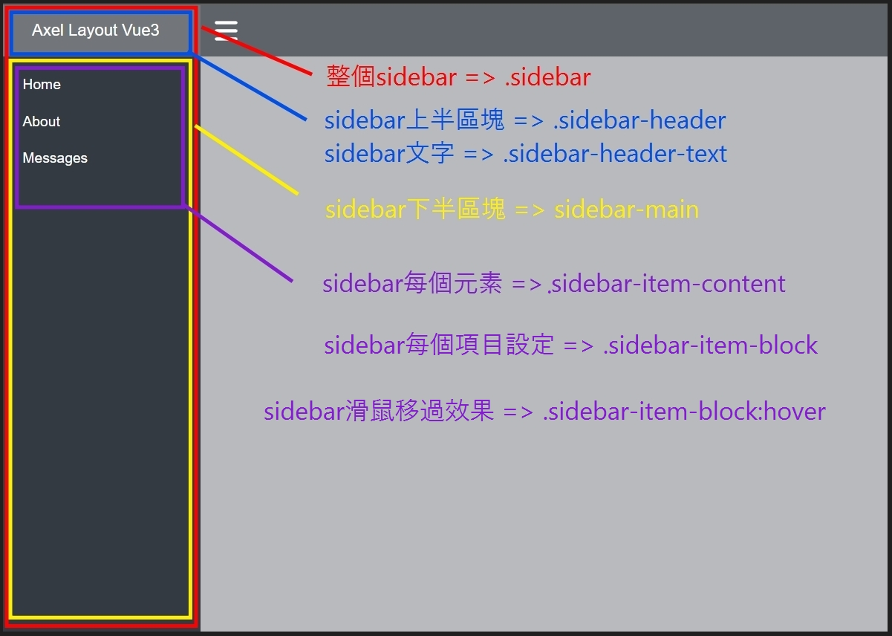
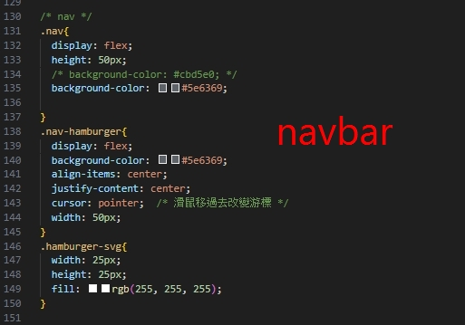
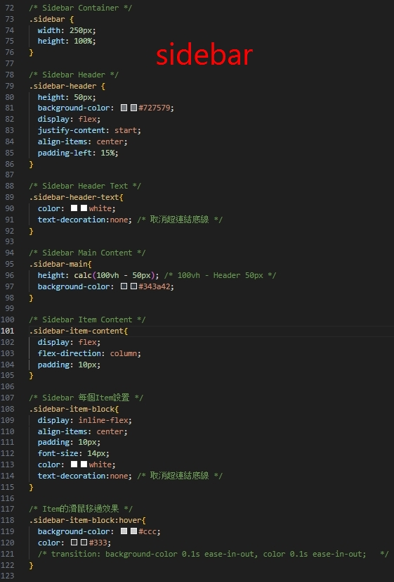

## Vue3 Simple Layout
---

## :pushpin: 使用技術
- Vue3 Composition API + Vite + Router
- CSS

## :clap: 目標
- 簡易含 sidebar + narbar + 漢堡選單 的頁面


## :herb: 展示
 

<br>

---

## :pushpin: Project Setup

1. Download Project 下載專案 (二選一)
    - Download ZIP
    - git Clone https://github.com/Axel1227/Vue3_SampleLayout.git

<br>

2. VSCode open Folder ( VSCode 開啟資料夾)

<br>

3. 開啟終端機 ( ctrl + ` )

<br>

4. 安裝套件
    ``` shell
    npm install
    ```
<br>

5. 啟動服務
    ```
    npm run dev
    ```
<br>

---
## :pushpin: 文件結構

```
├─ .gitignore
├─ index.html
├─ package-lock.json
├─ package.json
├─ README.md  
├─ vite.config.js
├─ src
|  ├─ App.vue
|  ├─ main.js
|  ├─ router
|  |   └ index.js  
|  ├─ pages  
|  |   ├─ About.vue  
|  |   ├─ Home.vue  
|  |   ├─ Messages.vue  
|  |   ├─ Layout  
|  |   |   └ Layout.vue  
```

##  :pushpin: 文件說明
- .gitignore： 不要推送GitHub的檔案 (測試檔案、套件)  
- images： 存放用來Markdown連結的圖片
- index.html： `<body>`中的 id 為 app，`<script>`指向 `main.js` 檔案  
- package.json： 專案設定檔、版本、依賴模組、使用指令設定 (dev、build)
    - `run dev` => 本機啟動專案指令也是在這邊設定
- vite.config.js  => Vite設定檔
    - `src` => 指定打包 src 主要檔案與程式位置
- src 目錄： `存放主要的檔案、程式碼`
- src/App.vue： 網頁根元件
- src/main.js： 程式進入點
    - import `router` 元件也是在這邊設定
    - `mount(#app)` => 掛載到 `id=app` 上
- router/index.js： 所有頁面的 `router` 都會在這邊設定
- pages： 各個頁面及 Layout

<br>

---

## :pushpin: 頁面對應的CSS







<br>

---

## :pushpin: 漢堡選單邏輯
- 整個 `sidebar` 給予一個 `v-show="showSide"` => 預設 `true` 打開的狀態。
- 透過 `nav-hamburger` 給予一個 `@click` 事件。
- 當 `click`事件觸發時，給予 v-show 當前 bool 的`反向`，就可以做到開關 sidebar。


<br>

---

## :pushpin: Router 設定
